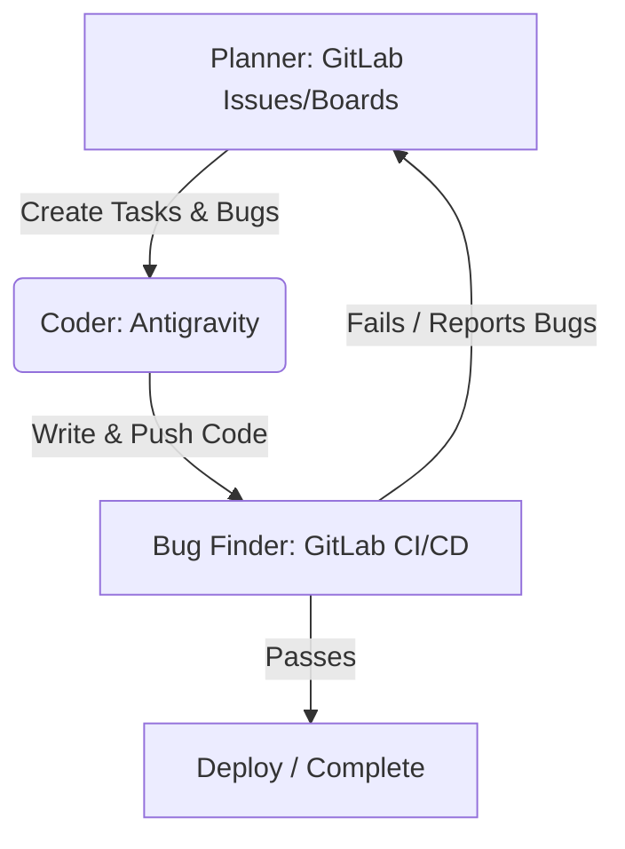

# GitLab Setup & Workflow Instructions for Video.AI

This guide details how to host your project on GitLab and configure your development workflow around three distinct roles: the **Planner** (GitLab Issues & Boards), the **Bug Finder** (GitLab CI/CD), and the **Coder** (Antigravity).

---

## 🚀 Part 1: Initial GitLab Setup

### Step 1: Create a GitLab Repository
1. Go to your GitLab account: [gitlab.com/projects/new](https://gitlab.com/projects/new)
2. Select **Create blank project**.
3. **Project name**: `Video.AI`
4. **Visibility Level**: Choose **Private** (recommended since your project contains proprietary configurations and assets).
5. **DO NOT** check "Initialize repository with a README" (we already have one).

### Step 2: Push Your Local Code to GitLab
Open PowerShell on your computer and run these commands to set GitLab as your primary repository remote:

```powershell
# Navigate to your project directory
cd C:\Video.AI

# Rename the existing github remote (if you had one) to keep it as a backup
git remote rename origin github-origin 2>$null

# Add GitLab as your new primary remote (REPLACE with your actual GitLab URL)
git remote add origin https://gitlab.com/YOUR_USERNAME/Video.AI.git

# Verify the remote points to GitLab
git remote -v

# Push your code to the GitLab main branch
git push -u origin main
```

---

## 🔄 Part 2: The Collaboration Workflow

This project is set up to work in a continuous loop between three components:



### 1. 📋 The Planner (GitLab Issues & Boards)
The **Planner** manages "what" to build and "when."
* **GitLab Issues**: Use GitLab Issues to plan new features, document bugs, or schedule refactoring.
* **GitLab Boards**: Go to **Plan > Issue Boards** in GitLab. You can create columns like `To Do`, `In Progress`, and `Done` to track status.
* **How to use**: Whenever you want a new feature or notice a bug, create a GitLab issue. Label it and assign it to the milestone or board.

### 2. 🛡️ The Bug Finder (GitLab CI/CD)
The **Bug Finder** automatically double-checks every line of code you or the Coder commits.
* **Pipeline Configuration**: Defined in `.gitlab-ci.yml`.
* **Automatic Checks run on every push**:
  1. **Python Quality**: Runs `Ruff` for code formatting and `Pytest` for testing.
  2. **Frontend Quality**: Runs ESLint, front-end tests, and builds the UI.
  3. **Security (Skylos Scan)**: Scans the codebase for security issues, hardcoded secrets, and dead code, saving a concise scan report as a downloadable CI artifact named `diagnostics/skylos_ci_scan.txt`.
* **How to use**: When you push code, check **Build > Pipelines** in GitLab. A green checkmark means the Bug Finder approved your code; a red cross means it found a bug that needs fixing.

### 3. 💻 The Coder (Antigravity)
The **Coder** (Antigravity AI) takes instructions from the Planner and reports from the Bug Finder to write code.
* **How to work with me**:
  1. Share the description of the GitLab Issue or the pipeline failure logs with me.
  2. I will write the code to implement the feature or fix the bug.
  3. You push the changes, letting the **Bug Finder** verify the fix.
* **Auto-closing Issues**: When committing code, you can use special keywords like `Fixes #12` or `Closes #12` (where `#12` is the GitLab Issue ID) to automatically close the issue once pushed to the main branch.

---

## 📦 Managing Large Files (Git LFS)

Since your project includes a ZIP file (`Video_AI_Source_Code.zip`) and potentially large model files, GitLab LFS is configured automatically via `.gitattributes`. To ensure it works:

```powershell
# Ensure Git LFS is installed and initialized on your system
git lfs install

# Track large files if you add new ones (e.g. models)
git lfs track "*.zip"
git lfs track "*.gguf"
git lfs track "*.safetensors"

# Push LFS files to GitLab
git push origin main
```
